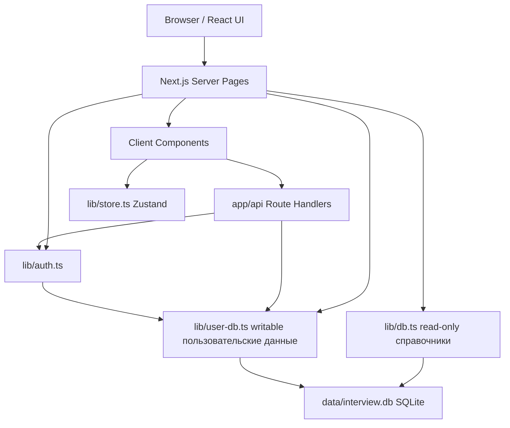
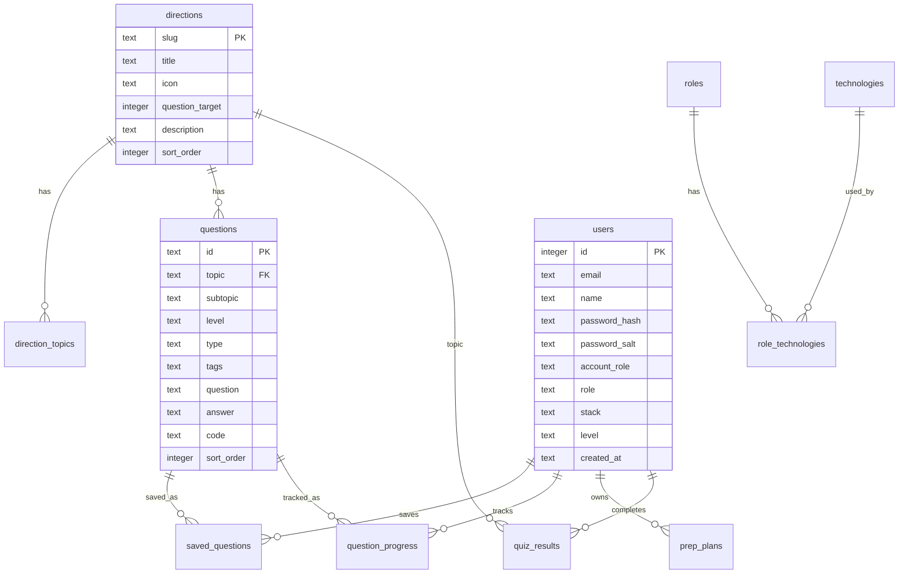
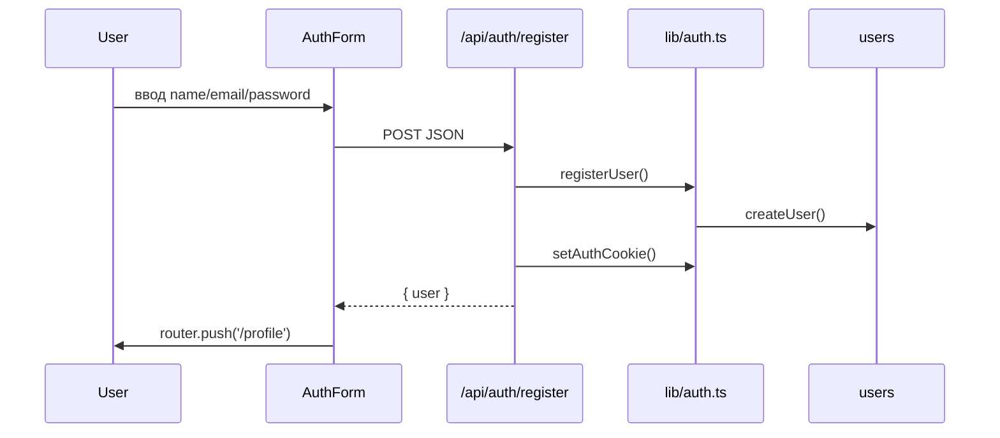
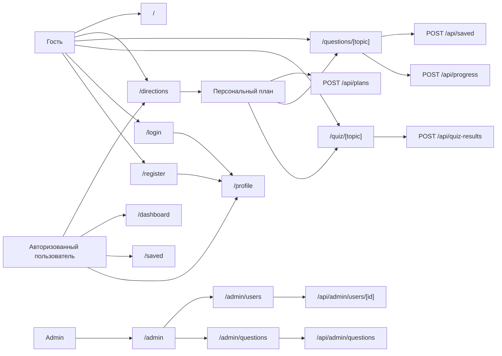

# Interview Prep Platform: полная структура сайта для разработчика

## 1. Назначение проекта

`Interview Prep Platform` - это платформа для подготовки к техническим IT-собеседованиям. Пользователь выбирает направление, роль, стек, уровень и срочность подготовки, после чего работает с вопросами, мини-тестами, закладками, прогрессом и персональными планами.

Проект построен как fullstack-приложение на Next.js App Router:

- frontend: React 19, TypeScript, Tailwind CSS;
- backend: Next.js Server Components и Route Handlers в `app/api`;
- база данных: локальная SQLite база `data/interview.db`;
- авторизация: самописный JWT в `httpOnly` cookie;
- клиентское состояние: Zustand для темы, закладок и отметок знания.

Главная идея архитектуры: публичные справочники и вопросы читаются из SQLite через `lib/db.ts`, пользовательские данные пишутся через `lib/user-db.ts`, а интерфейс получает первичные данные на сервере и отправляет действия через API routes.

## 2. Быстрый запуск

```bash
npm install
npm run dev
```

Открыть:

```text
http://localhost:3000
```

Дополнительные команды:

```bash
npm run build
npm run start
npm run lint
npm run db:seed
```

`npm run db:seed` полностью пересоздает `data/interview.db`, удаляя старую базу и наполняя ее начальными направлениями, вопросами, ролями, технологиями и админом.

Демо-админ после seed:

```text
email: admin@example.com
password: admin12345
```

## 3. Технологический стек

Основные зависимости:

- `next` - фреймворк приложения, App Router, Server Components, API routes.
- `react`, `react-dom` - UI.
- `typescript` - типизация.
- `tailwindcss`, `postcss`, `autoprefixer` - стили.
- `zustand` - легкое клиентское состояние.
- `framer-motion`, `prismjs`, `@next/mdx` - установлены, но в текущем коде почти не участвуют.
- `node:sqlite` - встроенный SQLite API Node.js, используется через `DatabaseSync`.

Важная особенность: проект зависит от `node:sqlite`, поэтому нужен современный Node.js, где этот модуль доступен.

## 4. Корневая структура проекта

```text
interview-project/
  app/
    api/
    admin/
    dashboard/
    directions/
    questions/[topic]/
    quiz/[topic]/
    saved/
    profile/
    login/
    register/
    about/
    blog/
    contact/
    globals.css
    layout.tsx
    page.tsx
  components/
  data/
    interview.db
  lib/
  public/
    icon_ip.png
  scripts/
    seed-db.mjs
  package.json
  next.config.ts
  tailwind.config.ts
  tsconfig.json
```

Назначение папок:

- `app` - маршруты, страницы, layout, API endpoints.
- `components` - клиентские и серверные React-компоненты.
- `lib` - бизнес-логика, работа с БД, авторизация, типы, Zustand store.
- `data` - SQLite база.
- `scripts` - скрипт первичного наполнения БД.
- `public` - публичные ассеты.

## 5. Глобальная архитектура связки



Общий паттерн:

1. Серверная страница читает cookie через `getCurrentUser()`.
2. Если пользователь есть, серверная страница подтягивает его статистику, закладки, прогресс или админские данные.
3. Страница передает данные в клиентский компонент.
4. Клиентский компонент меняет локальное состояние для мгновенного UI.
5. Клиентский компонент отправляет `fetch` в `app/api`.
6. API проверяет пользователя через `requireUser()` или `requireAdmin()`.
7. API пишет изменения в SQLite через `lib/user-db.ts`.

## 6. Маршруты страниц

| URL | Файл | Тип | Назначение | Основные зависимости |
| --- | --- | --- | --- | --- |
| `/` | `app/page.tsx` | Server Page | Главная, витрина направлений, статистика пользователя при входе | `getDirections`, `getCurrentUser`, `getUserStats` |
| `/directions` | `app/directions/page.tsx` | Server Page + Client | Мастер выбора роли, технологий, уровня, срочности и генерация плана | `DirectionsWizard`, `getDirections`, `getRoleTech` |
| `/questions/[topic]` | `app/questions/[topic]/page.tsx` | Server Page + Client | Список вопросов по направлению с фильтрами, закладками и прогрессом | `QuestionsClient`, `getDirection`, `getQuestionsByTopic`, `getSavedQuestionIds`, `getKnownQuestionIds` |
| `/quiz/[topic]` | `app/quiz/[topic]/page.tsx` | Server Page + Client | Мини-тест по направлению | `QuizClient`, `getDirection`, `getQuestionsByTopic` |
| `/dashboard` | `app/dashboard/page.tsx` | Server Page | Кабинет с прогрессом, статистикой, активностью | `getCurrentUser`, `getUserStats`, `getRecentActivity`, `getDirections` |
| `/saved` | `app/saved/page.tsx` | Server Page | Сохраненные вопросы пользователя | `getCurrentUser`, `getSavedQuestions` |
| `/profile` | `app/profile/page.tsx` | Server Page + Client | Профиль, форма редактирования, планы и результаты квизов | `ProfileForm`, `getUserPlans`, `getQuizResults`, `getUserStats` |
| `/login` | `app/login/page.tsx` | Client form | Вход | `AuthForm mode="login"` |
| `/register` | `app/register/page.tsx` | Client form | Регистрация | `AuthForm mode="register"` |
| `/admin` | `app/admin/page.tsx` | Server Page | Главная админ-панели | `getCurrentUser` |
| `/admin/users` | `app/admin/users/page.tsx` | Server Page + Client | Таблица пользователей и админские действия | `AdminUsersTable`, `listUsersForAdmin` |
| `/admin/questions` | `app/admin/questions/page.tsx` | Server Page + Client | Добавление вопроса | `AdminQuestionForm`, `getDirections` |
| `/about` | `app/about/page.tsx` | Static Page | О проекте | `Badge` |
| `/blog` | `app/blog/page.tsx` | Static Page | Статические карточки статей | `Badge` |
| `/contact` | `app/contact/page.tsx` | Static Page | Статическая контактная форма без backend-обработки | `Badge` |

## 7. Layout и общие элементы

### `app/layout.tsx`

Глобальная оболочка:

- подключает `app/globals.css`;
- задает metadata;
- рендерит `Header`;
- рендерит `children`;
- рендерит `Footer`.

`Header` является async server component, потому что внутри вызывает `getCurrentUser()` и меняет навигацию в зависимости от авторизации.

### `components/header.tsx`

Показывает:

- логотип и ссылку на `/`;
- навигацию: направления, вопросы, блог, о нас;
- ссылку `/admin`, если `user.accountRole === "admin"`;
- кнопки входа/регистрации для гостя;
- профиль и logout для авторизованного пользователя;
- переключатель темы.

### `components/footer.tsx`

Статический футер с группами ссылок. Часть ссылок сейчас ведет на `#`, то есть это заглушки.

### `components/ui.tsx`

Общие UI-примитивы:

- `Badge`;
- `ProgressBar`;
- `SectionTitle`;
- `DirectionCard`.

## 8. База данных

Файл базы:

```text
data/interview.db
```

Создание и наполнение:

```text
scripts/seed-db.mjs
```

В `lib/db.ts` база открывается в read-only режиме для публичных справочников. В `lib/user-db.ts` база открывается на запись и дополнительно вызывает `ensureUserTables()`, чтобы создать пользовательские таблицы, если их нет.

### 8.1. Таблица `directions`

Справочник направлений подготовки.

| Поле | Тип | Описание |
| --- | --- | --- |
| `slug` | text primary key | URL-ключ направления, например `javascript`, `react`, `sql` |
| `title` | text | Название направления |
| `icon` | text | Короткая текстовая иконка |
| `question_target` | integer | Целевое/маркетинговое число вопросов |
| `description` | text | Описание направления |
| `sort_order` | integer | Порядок вывода |

Используется на главной, в выборе направлений, в вопросах, квизах и админской форме добавления вопроса.

### 8.2. Таблица `direction_topics`

Подтемы внутри направления.

| Поле | Тип | Описание |
| --- | --- | --- |
| `id` | integer primary key autoincrement | ID |
| `direction_slug` | text foreign key | Ссылка на `directions.slug` |
| `title` | text | Название подтемы |
| `sort_order` | integer | Порядок вывода |

Связь: одно направление имеет много подтем.

### 8.3. Таблица `questions`

Банк вопросов.

| Поле | Тип | Описание |
| --- | --- | --- |
| `id` | text primary key | Уникальный ID вопроса |
| `topic` | text foreign key | Ссылка на `directions.slug` |
| `subtopic` | text | Подтема |
| `level` | text | `Junior`, `Middle`, `Senior` |
| `type` | text | `theory`, `practice`, `code` |
| `tags` | text | JSON-массив тегов |
| `question` | text | Текст вопроса |
| `answer` | text | Ответ |
| `code` | text nullable | Необязательный код |
| `sort_order` | integer | Порядок вывода |

Связи:

- `questions.topic -> directions.slug`;
- `saved_questions.question_id -> questions.id`;
- `question_progress.question_id -> questions.id`.

### 8.4. Таблица `roles`

Справочник ролей для мастера плана.

| Поле | Тип | Описание |
| --- | --- | --- |
| `id` | integer primary key autoincrement | ID |
| `title` | text unique | Название роли |
| `sort_order` | integer | Порядок вывода |

Примеры ролей: `Frontend Developer`, `Backend Developer`, `Fullstack Developer`, `DevOps / SRE`.

### 8.5. Таблица `technologies`

Справочник технологий.

| Поле | Тип | Описание |
| --- | --- | --- |
| `id` | integer primary key autoincrement | ID |
| `title` | text unique | Название технологии |

### 8.6. Таблица `role_technologies`

Many-to-many связка ролей и технологий.

| Поле | Тип | Описание |
| --- | --- | --- |
| `role_id` | integer foreign key | Ссылка на `roles.id` |
| `technology_id` | integer foreign key | Ссылка на `technologies.id` |
| `sort_order` | integer | Порядок технологии внутри роли |

Primary key: `(role_id, technology_id)`.

Используется в `getRoleTech()`, чтобы мастер подготовки знал, какие технологии показывать для выбранной роли.

### 8.7. Таблица `users`

Пользователи.

| Поле | Тип | Описание |
| --- | --- | --- |
| `id` | integer primary key autoincrement | ID пользователя |
| `email` | text unique | Email, хранится в lowercase |
| `name` | text | Имя |
| `password_hash` | text | PBKDF2 hash |
| `password_salt` | text | Salt |
| `account_role` | text | `user` или `admin` |
| `role` | text nullable | Профессиональная роль пользователя |
| `stack` | text nullable | Стек пользователя |
| `level` | text nullable | Уровень пользователя |
| `created_at` | text | Дата создания |

### 8.8. Таблица `saved_questions`

Закладки пользователя.

| Поле | Тип | Описание |
| --- | --- | --- |
| `user_id` | integer foreign key | Ссылка на `users.id` |
| `question_id` | text foreign key | Ссылка на `questions.id` |
| `created_at` | text | Дата сохранения |

Primary key: `(user_id, question_id)`.

### 8.9. Таблица `question_progress`

Прогресс по вопросам.

| Поле | Тип | Описание |
| --- | --- | --- |
| `user_id` | integer foreign key | Ссылка на `users.id` |
| `question_id` | text foreign key | Ссылка на `questions.id` |
| `status` | text | `known` или `unknown` |
| `updated_at` | text | Дата обновления |

Primary key: `(user_id, question_id)`.

API использует upsert: повторная отметка вопроса обновляет `status` и `updated_at`.

### 8.10. Таблица `prep_plans`

Сохраненные планы подготовки.

| Поле | Тип | Описание |
| --- | --- | --- |
| `id` | integer primary key autoincrement | ID плана |
| `user_id` | integer foreign key | Ссылка на `users.id` |
| `role` | text | Выбранная роль |
| `level` | text | Выбранный уровень |
| `urgency` | text | Срочность |
| `technologies` | text | JSON-массив технологий |
| `plan` | text | JSON-массив `PlanItem` |
| `created_at` | text | Дата создания |

### 8.11. Таблица `quiz_results`

Результаты мини-тестов.

| Поле | Тип | Описание |
| --- | --- | --- |
| `id` | integer primary key autoincrement | ID результата |
| `user_id` | integer foreign key | Ссылка на `users.id` |
| `topic` | text foreign key | Ссылка на `directions.slug` |
| `score` | integer | Баллы |
| `total` | integer | Всего вопросов |
| `weak_topics` | text | JSON-массив слабых тем |
| `created_at` | text | Дата создания |

## 9. ER-схема данных



## 10. API endpoints

### Auth

| Method | URL | Файл | Доступ | Назначение |
| --- | --- | --- | --- | --- |
| `POST` | `/api/auth/register` | `app/api/auth/register/route.ts` | Гость | Создает пользователя, ставит cookie |
| `POST` | `/api/auth/login` | `app/api/auth/login/route.ts` | Гость | Проверяет пароль, ставит cookie |
| `POST` | `/api/auth/logout` | `app/api/auth/logout/route.ts` | Любой | Удаляет cookie |
| `GET` | `/api/auth/me` | `app/api/auth/me/route.ts` | Любой | Возвращает текущего пользователя или `null` |

### User actions

| Method | URL | Файл | Доступ | Назначение |
| --- | --- | --- | --- | --- |
| `PUT` | `/api/profile` | `app/api/profile/route.ts` | User | Обновляет профиль |
| `POST` | `/api/saved` | `app/api/saved/route.ts` | User | Добавляет или удаляет вопрос из закладок |
| `POST` | `/api/progress` | `app/api/progress/route.ts` | User | Сохраняет `known` или `unknown` по вопросу |
| `POST` | `/api/plans` | `app/api/plans/route.ts` | User | Сохраняет персональный план |
| `POST` | `/api/quiz-results` | `app/api/quiz-results/route.ts` | User | Сохраняет результат квиза |

### Admin

| Method | URL | Файл | Доступ | Назначение |
| --- | --- | --- | --- | --- |
| `POST` | `/api/admin/questions` | `app/api/admin/questions/route.ts` | Admin | Добавляет вопрос в `questions` и при необходимости подтему |
| `PUT` | `/api/admin/users/[id]` | `app/api/admin/users/[id]/route.ts` | Admin | Обновляет пользователя и роль |
| `PATCH` | `/api/admin/users/[id]` | `app/api/admin/users/[id]/route.ts` | Admin | Меняет пароль пользователя |
| `DELETE` | `/api/admin/users/[id]` | `app/api/admin/users/[id]/route.ts` | Admin | Удаляет пользователя |

## 11. Авторизация и безопасность

Файл:

```text
lib/auth.ts
```

### 11.1. Пароли

Пароли не хранятся открытым текстом. Используется:

- `crypto.randomBytes(16)` для salt;
- `crypto.pbkdf2Sync(password, salt, 120000, 32, "sha256")`;
- `crypto.timingSafeEqual()` при проверке.

### 11.2. JWT

JWT создается вручную:

- header: `{ alg: "HS256", typ: "JWT" }`;
- payload: `sub`, `email`, `exp`;
- подпись: HMAC SHA-256.

Секрет:

```text
process.env.JWT_SECRET ?? "local-dev-secret-change-me"
```

Для production нужно обязательно задать `JWT_SECRET`.

Cookie:

```text
name: interview_token
httpOnly: true
sameSite: lax
secure: true only in production
path: /
maxAge: 7 days
```

### 11.3. Проверка доступа

Функции:

- `getCurrentUser()` - возвращает пользователя или `null`;
- `requireUser()` - возвращает пользователя или бросает `UNAUTHORIZED`;
- `requireAdmin()` - требует авторизацию и `accountRole === "admin"`, иначе бросает `FORBIDDEN`.

Админские страницы дополнительно проверяют роль на уровне server page, а админские API проверяют роль через `requireAdmin()`.

## 12. Главные пользовательские сценарии

### 12.1. Регистрация



Валидация:

- email обязателен;
- name обязателен;
- password минимум 6 символов;
- email уникальный.

### 12.2. Вход

1. `AuthForm` отправляет email/password в `/api/auth/login`.
2. API вызывает `loginUser()`.
3. `loginUser()` ищет пользователя по email и проверяет пароль.
4. При успехе API ставит JWT cookie.
5. Клиент переходит на `/profile` и вызывает `router.refresh()`.

### 12.3. Выбор направления и создание плана

Файлы:

- `app/directions/page.tsx`;
- `components/directions-wizard.tsx`;
- `lib/data.ts`;
- `app/api/plans/route.ts`;
- `lib/user-db.ts`.

Поток:

1. Сервер загружает `directions` и `roleTech`.
2. `DirectionsWizard` показывает 4 шага:
   - роль;
   - технологии;
   - уровень;
   - срочность.
3. На каждом изменении строится `draftPlan` через `buildPlan()`.
4. На последнем шаге план сохраняется через `POST /api/plans`.
5. Если пользователь не авторизован, API вернет 401, а UI покажет сообщение, что нужно войти.
6. План остается видимым в UI даже если сохранение не удалось.

Логика `buildPlan()`:

- берет выбранные технологии;
- добавляет срочные или расширенные темы в зависимости от `urgency`;
- убирает дубли через `Set`;
- берет максимум 7 пунктов;
- каждому пункту назначает:
  - `priority`;
  - `focus`;
  - `duration`;
  - `slug` направления для ссылок `/questions/[slug]` и `/quiz/[slug]`;
  - `role`.

### 12.4. Работа с вопросами

Файлы:

- `app/questions/[topic]/page.tsx`;
- `components/questions-client.tsx`;
- `lib/store.ts`;
- `app/api/saved/route.ts`;
- `app/api/progress/route.ts`.

Поток:

1. Сервер получает `topic` из URL.
2. Загружает направление `getDirection(topic)`.
3. Загружает вопросы `getQuestionsByTopic(topic)`.
4. Если пользователь авторизован:
   - загружает IDs сохраненных вопросов;
   - загружает IDs известных вопросов.
5. `QuestionsClient` кладет начальные IDs в Zustand.
6. Пользователь фильтрует вопросы по:
   - поиску;
   - уровню;
   - типу;
   - подтеме.
7. Пользователь открывает вопрос, видит ответ и код.
8. Кнопка `Сохранить`:
   - оптимистично меняет Zustand;
   - отправляет `POST /api/saved`;
   - при ошибке откатывает локальное состояние.
9. Кнопки `Знаю` и `Не знаю`:
   - меняют Zustand;
   - отправляют `POST /api/progress`.

Прогресс на странице считается клиентом:

```text
known.length / questions.length * 100
```

Важно: `known.length` берется глобально из Zustand, поэтому если в store попадут IDs из другого направления, процент может быть неточным. Сейчас при открытии страницы store перезаписывается серверными `initialKnown`, поэтому обычный сценарий работает корректно.

### 12.5. Мини-тест

Файлы:

- `app/quiz/[topic]/page.tsx`;
- `components/quiz-client.tsx`;
- `app/api/quiz-results/route.ts`.

Поток:

1. Сервер загружает направление и вопросы по `topic`.
2. Клиентский квиз показывает максимум 6 вопросов.
3. Есть два режима:
   - `cards` - пользователь сам отмечает, знал или не знал;
   - `choice` - пользователь выбирает подтему из вариантов.
4. `score` считается на клиенте.
5. Когда квиз завершен:
   - если пользователь авторизован;
   - и результат еще не сохранен;
   - `useEffect` отправляет `POST /api/quiz-results`.
6. Итоговая страница показывает результат и слабые темы.

Слабые темы сейчас вычисляются упрощенно:

```text
questions.filter((_, index) => index >= score).slice(0, 3).map(subtopic)
```

Это не точная история неправильных ответов, а приблизительная рекомендация по счету.

### 12.6. Профиль

Файлы:

- `app/profile/page.tsx`;
- `components/profile-form.tsx`;
- `app/api/profile/route.ts`.

Если пользователь не вошел, страница показывает приглашение войти.

Если пользователь вошел, страница показывает:

- имя и email;
- роль аккаунта;
- ссылку в админку для admin;
- статистику: планы, квизы, закладки, точность;
- форму профиля;
- последние сохраненные планы;
- последние результаты квизов.

Редактирование профиля:

1. `ProfileForm` показывает форму, если профиль еще не заполнен.
2. Пользователь сохраняет name/role/stack/level.
3. Компонент отправляет `PUT /api/profile`.
4. API вызывает `updateUserProfile()`.
5. Клиент обновляет локальное состояние и вызывает `router.refresh()`.

### 12.7. Dashboard

Файл:

```text
app/dashboard/page.tsx
```

Показывает:

- количество пройденных вопросов;
- точность;
- количество результатов тестов;
- количество закладок;
- прогресс по темам;
- последнюю активность;
- блок повторения.

Реальная статистика берется из `getUserStats()` и `getRecentActivity()`. Прогресс по темам сейчас отображается фиксированной формулой `86 - index * 9`, то есть это визуальный mock, а не расчет по каждой теме.

### 12.8. Закладки

Файл:

```text
app/saved/page.tsx
```

Если пользователь не вошел, показывается предложение войти.

Если пользователь вошел:

- вызывается `getSavedQuestions(user.id)`;
- вопросы выводятся карточками;
- если закладок нет, показывается пустое состояние и ссылка на `/questions/javascript`.

### 12.9. Админка

Админский доступ определяется полем:

```text
users.account_role = 'admin'
```

#### `/admin`

Проверяет:

- нет пользователя -> нужно войти;
- пользователь не admin -> недостаточно прав;
- admin -> ссылки на управление пользователями и вопросами.

#### `/admin/users`

Поток:

1. Сервер проверяет текущего пользователя.
2. Если admin, вызывает `listUsersForAdmin()`.
3. `listUsersForAdmin()` для каждого пользователя считает:
   - сколько записей прогресса;
   - сколько `known`;
   - сколько закладок;
   - сколько планов;
   - сколько квизов;
   - accuracy.
4. `AdminUsersTable` показывает таблицу.

Действия:

- сменить роль: `PUT /api/admin/users/[id]`;
- сменить пароль: `PATCH /api/admin/users/[id]`;
- удалить пользователя: `DELETE /api/admin/users/[id]`.

Защита:

- нельзя снять admin-роль с самого себя;
- нельзя удалить самого себя;
- пароль минимум 6 символов.

#### `/admin/questions`

Поток:

1. Сервер проверяет admin.
2. Загружает направления.
3. `AdminQuestionForm` отправляет данные в `POST /api/admin/questions`.
4. API валидирует поля.
5. Генерирует ID:

```text
{topic}-{slugified-subtopic}-{slugified-question-start}
```

6. `addQuestion()`:
   - проверяет, что направление существует;
   - проверяет, что ID не занят;
   - добавляет вопрос;
   - если такой подтемы еще нет в `direction_topics`, добавляет подтему.

## 13. Компоненты и их ответственность

| Компонент | Тип | Ответственность |
| --- | --- | --- |
| `Header` | Server | Навигация, состояние входа, ссылка на admin |
| `Footer` | Server/static | Футер |
| `ThemeToggle` | Client | Переключение `dark` класса через Zustand |
| `LogoutButton` | Client | `POST /api/auth/logout`, переход на `/` |
| `AuthForm` | Client | Login/register формы |
| `DirectionsWizard` | Client | Мастер плана подготовки и сохранение плана |
| `QuestionsClient` | Client | Фильтры, раскрытие вопросов, закладки, прогресс |
| `QuizClient` | Client | Квиз, счет, сохранение результата |
| `ProfileForm` | Client | Редактирование профиля |
| `AdminUsersTable` | Client | Таблица пользователей, действия admin |
| `AdminQuestionForm` | Client | Добавление вопроса |
| `Badge` | Server-compatible | Метка |
| `ProgressBar` | Server-compatible | Полоса прогресса |
| `SectionTitle` | Server-compatible | Заголовок секции |
| `DirectionCard` | Server-compatible | Карточка направления |

## 14. Zustand store

Файл:

```text
lib/store.ts
```

Состояние:

```ts
type PrepState = {
  saved: string[];
  known: string[];
  theme: "light" | "dark";
  toggleSaved: (id: string) => void;
  markKnown: (id: string, known: boolean) => void;
  setSaved: (ids: string[]) => void;
  setKnown: (ids: string[]) => void;
  toggleTheme: () => void;
};
```

Использование:

- `QuestionsClient` синхронизирует `initialSaved` и `initialKnown` с Zustand.
- `QuestionsClient` оптимистично обновляет `saved` и `known`.
- `ThemeToggle` переключает `theme` и класс `.dark` на `document.documentElement`.

Ограничение: тема не сохраняется в localStorage, поэтому после перезагрузки возвращается `light`.

## 15. Стили и дизайн-система

Файлы:

- `app/globals.css`;
- `tailwind.config.ts`.

CSS variables:

- `--background`;
- `--foreground`;
- `--card`;
- `--card-foreground`;
- `--muted`;
- `--muted-foreground`;
- `--border`;
- `--primary`;
- `--primary-foreground`.

Tailwind подключает эти переменные как цвета:

- `bg-background`;
- `text-foreground`;
- `bg-card`;
- `border-border`;
- `text-muted-foreground`;
- `bg-primary`;
- `text-primary-foreground`.

Темная тема включается классом:

```text
html.dark
```

## 16. Важные функции `lib/db.ts`

`lib/db.ts` работает с публичными справочниками в read-only режиме.

### `getDirections()`

Возвращает список направлений с подтемами.

SQL:

- читает `directions`;
- делает `left join direction_topics`;
- собирает темы через `json_group_array(dt.title)`;
- сортирует по `d.sort_order`.

### `getDirection(slug)`

Возвращает одно направление.

Если направление не найдено, возвращает первое направление по `sort_order`. Это fallback, из-за которого страница с неизвестным `topic` не падает.

### `getQuestionsByTopic(topic)`

Возвращает вопросы по `topic`.

Если вопросов по topic нет, включает fallback:

```text
javascript, react, typescript
```

### `getRoleTech()`

Возвращает роли и связанные технологии.

Использует таблицы:

- `roles`;
- `role_technologies`;
- `technologies`.

## 17. Важные функции `lib/user-db.ts`

`lib/user-db.ts` работает с пользовательскими таблицами и открывает SQLite на запись.

Основные группы функций:

### Пользователи

- `createUser()`;
- `getAuthUserByEmail()`;
- `getUserById()`;
- `updateUserProfile()`.

### Админка

- `listUsersForAdmin()`;
- `updateUserByAdmin()`;
- `updateUserPassword()`;
- `deleteUserByAdmin()`.

### Закладки и прогресс

- `getSavedQuestionIds()`;
- `setSavedQuestion()`;
- `setQuestionProgress()`;
- `getKnownQuestionIds()`;
- `getSavedQuestions()`.

### Планы и квизы

- `savePlan()`;
- `saveQuizResult()`;
- `getUserStats()`;
- `getRecentActivity()`;
- `getUserPlans()`;
- `getQuizResults()`.

## 18. Основные типы

Файл:

```text
lib/data.ts
```

```ts
export type Level = "Junior" | "Middle" | "Senior";
export type QuestionType = "theory" | "practice" | "code";

export type Direction = {
  slug: string;
  title: string;
  icon: string;
  questions: number;
  topics: string[];
  description: string;
};

export type InterviewQuestion = {
  id: string;
  topic: string;
  subtopic: string;
  level: Level;
  type: QuestionType;
  tags: string[];
  question: string;
  answer: string;
  code?: string;
};

export type RoleTech = {
  role: string;
  technologies: string[];
};

export type PlanItem = {
  title: string;
  priority: number;
  focus: string;
  duration: string;
  slug: string;
  role: string;
};
```

## 19. Полная карта пользовательских данных

```text
User
  -> saved_questions
      -> questions
          -> directions

User
  -> question_progress
      -> questions
          -> directions

User
  -> prep_plans
      -> JSON technologies
      -> JSON plan items
          -> directions through PlanItem.slug

User
  -> quiz_results
      -> directions through topic
      -> JSON weak_topics
```

## 20. Полная карта публичного контента

```text
directions
  -> direction_topics
  -> questions

roles
  -> role_technologies
      -> technologies
```

Публичный контент используется даже без авторизации:

- главная;
- направления;
- список вопросов;
- квизы;
- блог/about/contact.

Пользовательские сохранения требуют авторизации:

- планы;
- закладки;
- прогресс;
- результаты тестов;
- профиль.

## 21. Обработка ошибок

Типичные HTTP-статусы:

- `400` - некорректные данные запроса;
- `401` - пользователь не авторизован;
- `403` - пользователь не admin;
- `404` - пользователь не найден в админском API;
- `409` - конфликт, например duplicate email или duplicate question;
- `500` - неизвестная ошибка.

Большинство клиентских компонентов показывают текст ошибки в UI. Некоторые действия, например сохранение результата квиза, отправляются без явного UI-уведомления.

## 22. Текущие ограничения и места для доработки

1. Контактная форма на `/contact` не отправляет данные на сервер.
2. Ссылки в футере в основном ведут на `#`.
3. `buildPlan()` содержит текстовые проверки срочности, завязанные на строку `urgency`; лучше заменить на enum.
4. Тема не сохраняется между перезагрузками.
5. Прогресс по темам на `/dashboard` частично моковый.
6. Слабые темы в квизе вычисляются приблизительно, а не по реальным ошибкам.
7. JWT реализован вручную; для production стоит рассмотреть проверенную библиотеку и ротацию секретов.
8. В production обязательно нужен `JWT_SECRET`.
9. `lib/user-db.ts` вызывает `ensureUserTables()` при каждом открытии writable DB. Это удобно для dev, но в production лучше заменить миграциями.
10. В коде есть русские строки, которые в некоторых окружениях могут отображаться с неправильной кодировкой. Если редактор показывает mojibake, нужно привести файлы к UTF-8.

## 23. Как добавить новое направление

Варианты:

### Через seed

1. Открыть `scripts/seed-db.mjs`.
2. Добавить элемент в массив `directions`.
3. Добавить вопросы в массив `questions`.
4. При необходимости добавить технологии в `roleTechnologies`.
5. Запустить:

```bash
npm run db:seed
```

Важно: seed удалит текущую базу и пользовательские данные.

### Через SQL/админку

Админка сейчас умеет добавлять вопросы только в уже существующие направления. Чтобы добавить новое направление без seed, нужно добавить запись в `directions` и подтемы в `direction_topics` вручную или отдельным API/скриптом.

## 24. Как добавить новый вопрос через админку

1. Войти как admin.
2. Открыть `/admin/questions`.
3. Выбрать направление.
4. Заполнить:
   - подтему;
   - уровень;
   - тип;
   - теги;
   - вопрос;
   - ответ;
   - код при необходимости.
5. Отправить форму.

После сохранения вопрос сразу появляется на `/questions/[topic]`.

## 25. Как добавить новую страницу

Для новой страницы в App Router:

1. Создать папку в `app`, например:

```text
app/roadmap/page.tsx
```

2. Добавить React-компонент страницы.
3. Если нужна ссылка в навигации, обновить `nav` в `components/header.tsx`.
4. Если нужна ссылка в футере, обновить `groups` в `components/footer.tsx`.
5. Если нужны данные пользователя, использовать `getCurrentUser()` только в server component/page.
6. Если нужны действия с записью в БД, создать route handler в `app/api`.

## 26. Как добавить новый API endpoint

1. Создать файл:

```text
app/api/{name}/route.ts
```

2. Экспортировать нужный HTTP метод:

```ts
export async function POST(request: Request) {
  // ...
}
```

3. Для пользовательского доступа вызвать:

```ts
const user = await requireUser();
```

4. Для админского доступа вызвать:

```ts
await requireAdmin();
```

5. Возвращать `NextResponse.json()`.

## 27. Главная логика сайта одной схемой



## 28. Что нужно знать новому разработчику

1. Это не отдельный backend и frontend, а единое Next.js приложение.
2. Server Pages читают данные напрямую из SQLite.
3. Client Components не трогают БД напрямую, только через `fetch` к `app/api`.
4. Авторизация хранится в cookie `interview_token`.
5. Публичные данные: направления, темы, вопросы, роли, технологии.
6. Приватные данные: профиль, планы, закладки, прогресс, результаты квизов.
7. Админ отличается только `users.account_role`.
8. Seed пересоздает всю базу.
9. Основная точка расширения данных - SQLite таблицы и функции в `lib/db.ts`/`lib/user-db.ts`.
10. Основная точка расширения UI - страницы в `app` и компоненты в `components`.

## 29. Мини-чеклист перед изменениями

Перед изменением вопросов или направлений:

- проверить `scripts/seed-db.mjs`;
- проверить `lib/db.ts`;
- проверить страницы `/directions`, `/questions/[topic]`, `/quiz/[topic]`;
- помнить, что `topic` должен совпадать с `directions.slug`.

Перед изменением пользовательских данных:

- проверить схему в `lib/user-db.ts`;
- проверить API endpoint;
- проверить клиентский компонент, который делает `fetch`;
- проверить серверную страницу, которая читает результат.

Перед изменением авторизации:

- проверить `lib/auth.ts`;
- проверить `Header`;
- проверить `/api/auth/*`;
- проверить `requireUser()` и `requireAdmin()` в защищенных API.

Перед изменением админки:

- проверить server page защиту;
- проверить API защиту через `requireAdmin()`;
- проверить запреты на изменение или удаление самого себя.

## 30. Короткий словарь сущностей

- Direction - направление подготовки, например JavaScript или SQL.
- Direction topic - подтема внутри направления.
- Question - вопрос собеседования.
- Role - роль кандидата, например Frontend Developer.
- Technology - технология, связанная с ролью.
- Plan - персональный план подготовки.
- Saved question - вопрос в закладках.
- Question progress - отметка пользователя `known` или `unknown`.
- Quiz result - результат мини-теста.
- Account role - системная роль пользователя: `user` или `admin`.

